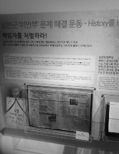

## 4.박물관의 ‘위안부’

정대협의 홈페이지뿐 아니라 2012년 5월 5일에 문을 연 ‘전쟁과 여성인권 박물관’ 역시 위안부에 관한 한 기본 이해와 설명은 다르지 않다. 위안부의 인원수에 관해 “그 수는 20만 명을 비롯해 여러 추정치가 있”다면서도, 8만 명설(센다)이나 5만 명설(요시미 요시아키)이나 그 이하의 숫자를 말하는 이들(하타 이쿠히코)은 열거하지 않는다. 그리고 위안부 문제에 관해 “식민지 조선에서 광범위하게 이루어진 동원 중에도 공식적으로 드러나지 않고 비밀리에 시행”했고 “정부의 관여 사실이 명백하게 드러나기 시작했지만 전면적인 책임 인정과 법적 책임을 이행하지 않은 채 미봉책만을 취했”다고 말한다(<사진7>).

사실 정대협의 현 대표는 책에서는 일본이 ‘1965년의 협정 때문에 국가 배상을 못 하고 있다’는 사실을 말하고 있다(『20년간의 수요일』). 운동 초기에는 말하지 않던 일이니, 아마도 뒤늦게 알게 된 사실일 것이다. 그런데도 국민들이 정보를 얻는 중요한 정보창구일 박물관이나 홈페이지에서는 그런 사실을 말하지 않는다. ‘미봉책’으로 간주한다고 하더라도 위안부 문제를 둘러싼 ‘박물관’인 이상 미봉책의 내용—일본 정부가 국민기금을 만들어 사죄와 함께 보상금을 전달했다는 사실—이나 상당수의 위안부들이 이 보상금을 받았다는 사실도 말해야 옳다. 그러나 그런 이야기는 적히지 않는다. 말하자면 위안부 문제에 대한 객관적인 지식보다도 정대협의 주장을 전달하는 데에 훨씬 비중이 두어져 있다. 그런 한 위안부 문제에 대한 ‘객관적’인 자료를 모은 장소라고 하기는 어렵다(이에 반해 정신대문제대책부산협의회, ‘부산 정대협’이 만든 자료관은 훨씬 많은 자료를 비치해두고 있어 전체 방향은 크게 다르지 않아도 방문자들이 객관적으로 사태를 볼 수 있도록 해준다).

**사진 7** 2012년 5월 5일에 문을 연 ‘전쟁과 여성인권 박물관’의 개관 당시의 전시물. 일본 정부가 책임을 인정하지 않고 ‘미봉책’만을 취했다면서 고노 담화를 ‘일본군의 개입 범죄 규모를 축소’한 것으로 설명하고 있다. 또 아시아여성기금은 ‘민간 모금’ ‘위로금을 지급’한 것이며 ‘국제기구 역시’ 기금을 ‘불충분한 조치라고 지적’했다고 설명한다. 하지만 이는 사실과는 다른 설명이었다.

물론 ‘전면적인 책임 인정’이란 ‘국가의 책임과 법적 책임’을 말하는 것일 터이다. 일본의 사죄와 보상을 둘러싼 경과에 대해서는 뒤에서 다시 살펴보겠지만, 그렇다 하더라도 일본이 한 일을 전혀 알리지 않는 것은 공정한 처사로 보기는 어렵다.

식민지였기에 ‘조선인 위안부’라는 존재가 생긴 건 사실이지만, 그들은 ‘황국신민서사’를 외우면서 일본군이 전쟁을 잘 수행할 수 있도록 모집된 존재이기도 했다. 그리고 그것은 식민지가 되는 순간 안을 수밖에 없는 모순이었다. 그런데 이러한 서술은 식민지의 그런 복잡한 측면을 보지 못하도록 만들고, 우리 자신을 완전한 피해자로 상상하도록 만든다. 결국 우리는 언제까지고 우리 자신을 알 수 없게 될 뿐이다.

그러나 우리 자신을 있는 그대로 직시하고 왜 그들이 그랬는지까지를 보지 않는 한 우리는 우리 자신을, 식민지가 된 우리 자신을 언제까지고 용서할 수가 없을 것이다. 그건 식민지화되면서 시작된 우리의 협력—자의건 타의건—을 타자화하고, 그로 인해 생긴 분열을 치유할 수 없다는 말이기도 하다. 다시 말해 언제까지고 일본에 의해 야기된 ‘분열된 민족’의 상태에서 살아야 한다는 것을 의미한다. 그리고 그런 한 우리에게 ‘일본의 식민지 배’가만든 후유증에서 벗어날수있는 날은 오지 않을 것이다.

불화는 증오심을 키우고, 증오심은 다시 적대와 불화를 만든다. 2000년대 들어 혐한 현상이 나타나기 시작하고 2010년대 이후에 ‘위안부’상과 박물관에 말뚝을 박는 식으로 노골적인 적대를 표명하는 일본인이 나오게 된 것은 그런 20년의 결과이기도 하다. 그런데도 그런 일본인이 나오게 된 원인을 단순히 일본 탓으로만 돌리는 한 사태는 더 악화될 뿐이다.

태평양전쟁 때 일본이 ‘위안부’를 필요시하고 위안부의 효과적인 공급을 위해 ‘관리’를 했던 건 분명하다. 그런 한 일본이 이 문제에 대한 ‘남은 책임’을 져야 한다는 것도 분명하다. 그러나 ‘책임’을 지도록 하기 위해서라면 더더욱, 그 ‘죄상’을 명확히 할 필요가 있다.

위안부 문제를 부정하는 이들이 ‘강제성’을 부정하는 것은 그들이 위안부에 관한 기억 중 ‘그들만의’ 기억에 집착하기 때문이다. 그들 가운데에는 위안부 문제를 완전히 부정하는 이들도 있지만, 대부분은 ‘강제연행’이나 ‘20만 명이라는 숫자’를 문제삼고 있다. 그리고 그 두 가지를 둘러싼 우리의 생각에 문제가 없지 않다는 것은 앞에서 본대로다. 위안부 문제를 부정하는 이들은 ‘위안’을 ‘매춘’으로만 생각했고 우리는 ‘강간’으로만 이해했지만, ○○○○ ○○○○○○ ○ ○ ○○○ ○ ○○○ ○○○○. 다시 말해 ‘위안’은 가혹한 먹이사슬 구조 속에서 실제로 돈을 버는 이들은 적었지만 ○○○○○○ ○○○ ○○○○ ○○○○○, ○○ ○○○○○ ○○○ ○○○○○. ○○ ○○○ ○○○○○.

이 20년 동안, 우리는 초기에 만들어진 ‘상식’에만 고집하고 그에 반하는 이야기는 무조건 ‘우익의 망동’이거나 ‘친일적 발언’으로 간주하고 배척해왔다. 그 결과, 우리 안에 남아 있는 것은 모든 ‘불순물’을 제거하고 ‘순수배양’된 ‘위안부 이야기’뿐이다.

그런 이야기들을 지켜온 것은, ‘피해구조’에 자칫 균열이 가해지는 데에 대한 두려움 때문일 것이다. 그러나 ‘피해구조’를 지키려고 애를 쓰면 쓸수록 그에 대한 반발도 커질 뿐이다. 그리고 거기에 처음부터 인권이나 아시아의 평화 같은 것에는 관심도 없는 이들의 가담과 주장이 섞이면서 타당한 비판조차도 들려오지 않게 된다. 그렇게 되면 다시 비판할 수 밖에 없게되 는 구조가 이어지게 되고, 그런 한 해결은 오지 않는다. 운동의 지속이 아니라 이 문제의 해결을 지향한다면 이제 조선인 위안부에 대한 이해를 바로잡을 필요가 있다.
